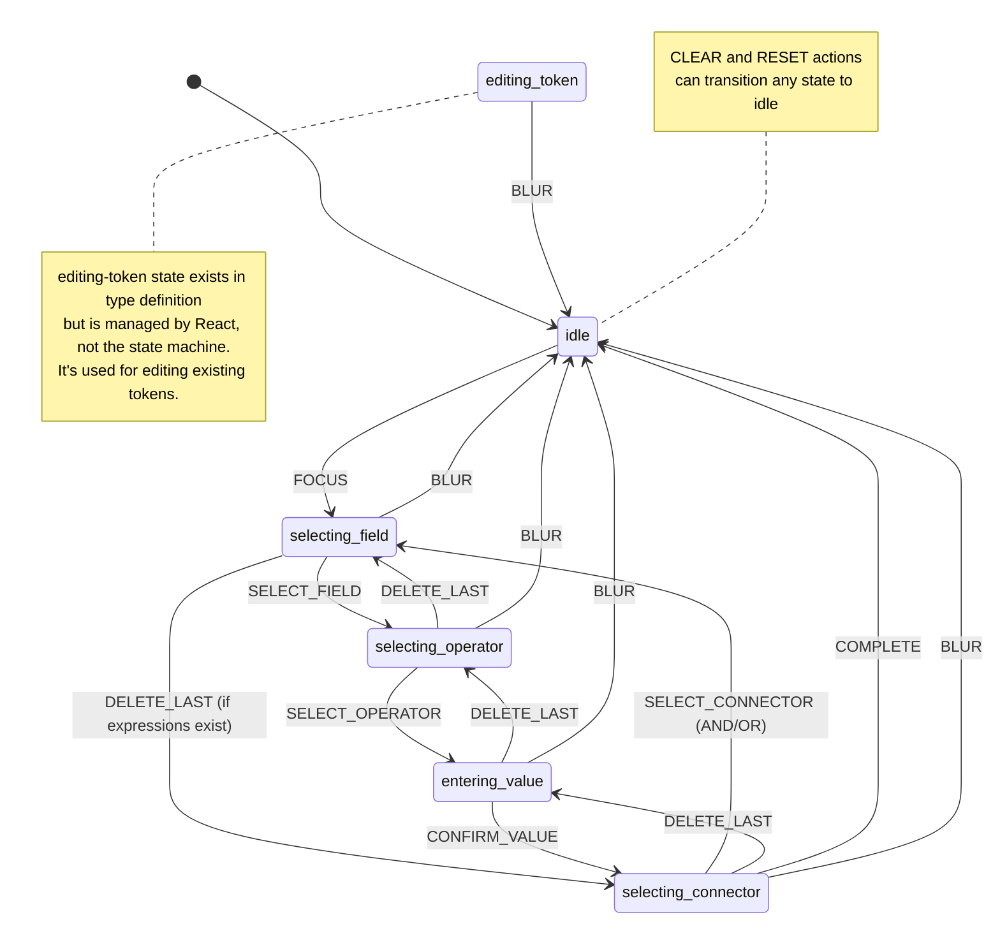

# State Machine Diagram

This document provides a comprehensive visual representation of the filter expression builder's state machine.

## Overview

The filter expression builder uses a sequential state machine to guide users through building filter expressions token-by-token (field → operator → value → connector).

## State Machine Class

The state machine is implemented in [`src/core/StateMachine.ts`](../../src/core/StateMachine.ts).

## State Transition Diagram



## State Descriptions

### idle

**Description:** Initial state with no active input.

**Available Actions:**

- `FOCUS` - Transitions to `selecting-field`
- `CLEAR` - Stays in `idle` (clears all data)
- `RESET` - Stays in `idle` (resets to initial state)

**Context:**

- No partial expression in progress
- May have completed expressions loaded

### selecting-field

**Description:** User is choosing a field for the filter condition.

**Available Actions:**

- `SELECT_FIELD` - Transitions to `selecting-operator`
- `BLUR` - Transitions to `idle` (discards partial progress)
- `DELETE_LAST` - Removes previous connector if expressions exist, transitions to `selecting-connector`
- `CLEAR` - Transitions to `idle`
- `RESET` - Transitions to `idle`

**Context:**

- No field selected yet
- May have completed expressions

### selecting-operator

**Description:** User is choosing an operator for the selected field.

**Available Actions:**

- `SELECT_OPERATOR` - Transitions to `entering-value`
- `DELETE_LAST` - Clears field, transitions to `selecting-field`
- `BLUR` - Transitions to `idle` (discards partial progress)
- `CLEAR` - Transitions to `idle`
- `RESET` - Transitions to `idle`

**Context:**

- `currentField` is set
- `currentOperator` is not set

### entering-value

**Description:** User is entering/selecting a value for the field-operator combination.

**Available Actions:**

- `CONFIRM_VALUE` - Creates expression, transitions to `selecting-connector`
- `DELETE_LAST` - Clears operator, transitions to `selecting-operator`
- `BLUR` - Transitions to `idle` (discards partial progress)
- `CLEAR` - Transitions to `idle`
- `RESET` - Transitions to `idle`

**Context:**

- `currentField` is set
- `currentOperator` is set
- Value is being entered

### selecting-connector

**Description:** User completed an expression and is choosing whether to add another (AND/OR) or finish.

**Available Actions:**

- `SELECT_CONNECTOR` (AND/OR) - Adds connector to last expression, transitions to `selecting-field`
- `COMPLETE` - Finishes expression building, transitions to `idle`
- `DELETE_LAST` - Removes last expression, restores it to `entering-value` state
- `BLUR` - Transitions to `idle` (keeps completed expressions)
- `CLEAR` - Transitions to `idle`
- `RESET` - Transitions to `idle`

**Context:**

- At least one completed expression
- Last expression has no connector yet

### editing-token

**Description:** User is editing an existing token (value, operator, or connector).

**Note:** This state is defined in the type system but is **managed by React** (`useFilterState`), not by the `FilterStateMachine` class. The state machine returns available actions but does not handle transitions from this state.

**Available Actions (from `getAvailableActions`):**

- `CONFIRM_VALUE` - (Handled by React)
- `BLUR` - (Handled by React, typically transitions to `idle`)

**Context:**

- Editing state is tracked in React via `editingTokenIndex`
- Machine context may have `currentField`/`currentOperator` set for edit operation

## Action Types

### Core Actions

- **FOCUS** - Start building expression (idle → selecting-field)
- **BLUR** - Cancel/exit expression building (any state → idle)
- **SELECT_FIELD** - Choose a field (selecting-field → selecting-operator)
- **SELECT_OPERATOR** - Choose an operator (selecting-operator → entering-value)
- **CONFIRM_VALUE** - Confirm a value (entering-value → selecting-connector)
- **SELECT_CONNECTOR** - Choose AND/OR (selecting-connector → selecting-field)
- **COMPLETE** - Finish expression (selecting-connector → idle)

### Navigation Actions

- **DELETE_LAST** - Remove last token/expression (reverse transition)

### Reset Actions

- **CLEAR** - Clear all expressions (any state → idle)
- **RESET** - Reset to initial state (any state → idle)

## Context State

The state machine maintains the following context:

```typescript
interface FilterContext {
  /** Completed filter expressions */
  completedExpressions: FilterExpression[]

  /** Currently selected field (during expression building) */
  currentField?: FieldValue

  /** Currently selected operator (during expression building) */
  currentOperator?: OperatorValue

  /** Pending connector (set when continuing after an expression) */
  pendingConnector?: 'AND' | 'OR'
}
```

## React State Extensions

The `useFilterState` hook extends the state machine with additional UI state:

- `isDropdownOpen` - Whether autocomplete dropdown is visible
- `highlightedIndex` - Currently highlighted suggestion
- `inputValue` - Current input field value
- `editingTokenIndex` - Index of token being edited (-1 if none)
- `selectedTokenIndex` - Index of selected token for deletion
- `allTokensSelected` - Whether all tokens are selected (Ctrl+A)
- `announcement` - Screen reader announcement text

## Dual State Management Note

⚠️ **Important:** The filter expression builder has two parallel state management systems:

1. **`FilterStateMachine` class** - Manages core expression building states
2. **`filterReducer` + `useFilterState` hook** - Manages UI states and editing

This duality is documented in the TODO-state-machine-review.md as a potential refactoring target. The `editing-token` state exemplifies this split - it's defined in the machine's types but actually managed by React.

## Testing

Comprehensive tests for all state transitions are in [`src/core/StateMachine.test.ts`](../../src/core/StateMachine.test.ts).

The test suite covers:

- ✅ All valid state transitions
- ✅ Invalid transition prevention
- ✅ Edge cases (multiple DELETE_LAST, loading expressions mid-transition, etc.)
- ✅ Context preservation and cleanup
- ✅ Reset and clear behavior
- ✅ Available actions for each state

## Usage Example

```typescript
import { FilterStateMachine } from './StateMachine'

const machine = new FilterStateMachine()

// Start building
machine.transition({ type: 'FOCUS' })
console.log(machine.getState()) // 'selecting-field'

// Select field
machine.transition({
  type: 'SELECT_FIELD',
  payload: { key: 'status', label: 'Status', type: 'enum' },
})
console.log(machine.getState()) // 'selecting-operator'

// Check available actions
console.log(machine.getAvailableActions()) // ['SELECT_OPERATOR', 'BLUR', 'DELETE_LAST']

// And so on...
```

## Related Documentation

- [State Shape](./state-shape.md) - Detailed state structure
- [Data Flow](./data-flow.md) - How data flows through the component
- [Component Tree](./component-tree.md) - Component hierarchy
- [TODO: State Machine Review](../../TODO-state-machine-review.md) - Future refactoring plans
